# 🤖 ALGORITMO DE MATCH INTELIGENTE COM IA
## GalaxIA Marketplace - Sistema de Busca e Rating Inteligente

> **Documento Técnico v1.0**  
> **Data:** Janeiro 2025  
> **Status:** Planejamento para implementação futura

---

## 🎯 **VISÃO GERAL DO SISTEMA**

### **Conceito Principal**
O Algoritmo de Match Inteligente da GalaxIA utilizará processamento de linguagem natural (NLP) e machine learning para:

1. **Interpretar** descrições de projetos em linguagem natural
2. **Analisar** múltiplas fontes de dados sobre freelancers
3. **Calcular** um rating de compatibilidade inteligente
4. **Rankear** profissionais por relevância e qualidade
5. **Recomendar** matches otimizados para ambas as partes

### **Diferencial Competitivo**
- **Busca Semântica**: Entende intenção, não apenas palavras-chave
- **Rating Multidimensional**: Considera 50+ fatores de match
- **Aprendizado Contínuo**: Melhora com cada interação
- **Contextualização**: Adapta-se ao perfil do cliente e histórico
- **Explicabilidade**: Mostra por que um freelancer foi recomendado

---

## 🧠 **ARQUITETURA DO ALGORITMO**

### **Pipeline de Processamento**

```mermaid
graph TD
    A[Descrição do Projeto] --> B[NLP Processor]
    B --> C[Intent Classification]
    B --> D[Entity Extraction]
    B --> E[Requirement Analysis]
    
    F[Freelancer Database] --> G[Multi-Source Analyzer]
    G --> H[Skill Profiling]
    G --> I[Performance Metrics]
    G --> J[Behavioral Analysis]
    
    C --> K[Match Engine]
    D --> K
    E --> K
    H --> K
    I --> K
    J --> K
    
    K --> L[Compatibility Score]
    L --> M[Ranking Algorithm]
    M --> N[Personalized Results]
```


### **Componentes Principais**

#### **1. NLP Processor (Processador de Linguagem Natural)**
```python
class NLPProcessor:
    def __init__(self):
        self.models = {
            'intent_classifier': load_model('intent_classification'),
            'entity_extractor': load_model('ner_model'),
            'sentiment_analyzer': load_model('sentiment_analysis'),
            'complexity_estimator': load_model('complexity_estimation')
        }
    
    def process_project_description(self, description: str) -> ProcessedProject:
        return {
            'intent': self.classify_intent(description),
            'entities': self.extract_entities(description),
            'requirements': self.analyze_requirements(description),
            'complexity': self.estimate_complexity(description),
            'sentiment': self.analyze_sentiment(description),
            'keywords': self.extract_keywords(description),
            'domain': self.classify_domain(description)
        }
```

#### **2. Multi-Source Data Analyzer**
```python
class MultiSourceAnalyzer:
    def __init__(self):
        self.data_sources = {
            'platform_history': PlatformHistoryAnalyzer(),
            'portfolio_analysis': PortfolioAnalyzer(),
            'external_verification': ExternalVerificationChecker(),
            'social_signals': SocialSignalsAnalyzer(),
            'market_positioning': MarketPositioningAnalyzer()
        }
    
    def analyze_freelancer(self, freelancer_id: str) -> FreelancerProfile:
        return {
            'skill_proficiency': self.analyze_skill_proficiency(freelancer_id),
            'reliability_score': self.calculate_reliability(freelancer_id),
            'communication_quality': self.assess_communication(freelancer_id),
            'delivery_performance': self.analyze_delivery_performance(freelancer_id),
            'client_satisfaction': self.calculate_satisfaction_score(freelancer_id),
            'portfolio_quality': self.assess_portfolio_quality(freelancer_id),
            'market_reputation': self.analyze_market_reputation(freelancer_id)
        }
```

#### **3. Compatibility Engine**
```python
class CompatibilityEngine:
    def __init__(self):
        self.weights = self.load_dynamic_weights()
        
    def calculate_match_score(self, project: ProcessedProject, 
                            freelancer: FreelancerProfile) -> MatchScore:
        scores = {
            'skill_alignment': self.calculate_skill_alignment(project, freelancer),
            'experience_relevance': self.calculate_experience_relevance(project, freelancer),
            'availability_match': self.calculate_availability_match(project, freelancer),
            'budget_compatibility': self.calculate_budget_compatibility(project, freelancer),
            'communication_fit': self.calculate_communication_fit(project, freelancer),
            'delivery_confidence': self.calculate_delivery_confidence(project, freelancer),
            'cultural_fit': self.calculate_cultural_fit(project, freelancer),
            'success_probability': self.predict_success_probability(project, freelancer)
        }
        
        weighted_score = sum(score * self.weights[dimension] 
                           for dimension, score in scores.items())
        
        return MatchScore(
            overall_score=weighted_score,
            dimension_scores=scores,
            confidence_level=self.calculate_confidence(scores),
            explanation=self.generate_explanation(scores, project, freelancer)
        )
```

---

## 📊 **FONTES DE DADOS PARA RATING**

### **1. Dados da Plataforma (Peso: 40%)**
```yaml
Performance Histórica:
  - Taxa de conclusão de projetos: 0-100%
  - Tempo médio de entrega vs. prazo: ratio
  - Qualidade das entregas: avaliações 1-5
  - Taxa de recontratação: %
  - Crescimento de preços ao longo do tempo: trend
  
Comportamento na Plataforma:
  - Tempo de resposta médio: horas
  - Taxa de aceitação de propostas: %
  - Frequência de login: daily/weekly/monthly
  - Engajamento com atualizações: score
  - Participação em features da plataforma: score

Relacionamento com Clientes:
  - Net Promoter Score (NPS): -100 a +100
  - Taxa de disputa: %
  - Resolução de conflitos: score
  - Comunicação proativa: score
  - Follow-up pós-projeto: score
```

### **2. Análise de Portfolio (Peso: 25%)**
```yaml
Qualidade Visual e Técnica:
  - Diversidade de projetos: score 1-10
  - Complexidade crescente: trend analysis
  - Originalidade vs. templates: ratio
  - Qualidade técnica: automated analysis
  - Apresentação profissional: score
  
Relevância e Especialização:
  - Alinhamento com nicho declarado: %
  - Consistência temporal: score
  - Evolução da qualidade: trend
  - Cases de sucesso documentados: count
  - ROI demonstrado em projetos: metrics

Validação Externa:
  - Links funcionais para projetos: %
  - Depoimentos verificados: count
  - Projetos com comprovação: %
  - Prêmios e reconhecimentos: score
  - Publicações e features: count
```

### **3. Verificações e Credenciais (Peso: 20%)**
```yaml
Verificação de Identidade:
  - KYC completo: boolean
  - Documentos validados: score
  - Verificação biométrica: boolean
  - Consistência de dados: score
  - Histórico de verificações: timeline

Credenciais Profissionais:
  - Formação validada: score
  - Certificações ativas: count/relevance
  - Experiência profissional comprovada: years
  - Referências profissionais: count/quality
  - Participação em organizações: count

Validação de Skills:
  - Testes técnicos realizados: score
  - Certificações de plataforma: count
  - Skills endossadas por outros: count
  - Projetos open source: contribution score
  - Reconhecimento por pares: score
```

### **4. Verificação Externa via APIs (Peso: 20%)**
```yaml
Dados Jurídicos e Profissionais:
  - Escavador/JusBrasil: processos, certidões, OAB
  - Receita Federal: situação fiscal, CNPJ ativo
  - SERASA/SPC: score de crédito, histórico financeiro
  - CRM/CREA/CFM: registros profissionais ativos
  - Tribunal de Justiça: processos trabalhistas/cíveis

Presença Digital Verificada:
  - LinkedIn: endossos, recomendações, atividade
  - GitHub: commits, repositórios, contribuições
  - Google Scholar: publicações acadêmicas, citações
  - ResearchGate: perfil acadêmico, h-index
  - Lattes: currículo acadêmico, pesquisas

Redes Sociais Profissionais:
  - Twitter/X: engajamento profissional, influência
  - Instagram: portfolio visual, engajamento
  - YouTube: tutoriais, palestras, expertise
  - Medium/Blog: artigos técnicos, thought leadership
  - Stack Overflow: reputação técnica, contribuições

Plataformas Especializadas:
  - Behance/Dribbble: portfolio design, likes, views
  - CodePen: projetos frontend, popularidade
  - Figma Community: templates, seguidores
  - Udemy/Coursera: cursos criados, avaliações
  - Kaggle: competições, datasets, notebooks

Marketplaces Concorrentes:
  - Upwork: histórico, ratings, earnings
  - Fiverr: gigs, reviews, seller level
  - 99designs: contests won, client feedback
  - Freelancer.com: portfolio, rankings
  - Workana: projetos, reputação
```

### **5. Análise Comportamental (Peso: 5%)**
```yaml
Padrões de Comunicação:
  - Tempo de resposta por horário: patterns
  - Qualidade de mensagens: NLP analysis
  - Proatividade em comunicação: score
  - Clareza e objetividade: score
  - Tom profissional: sentiment analysis

Confiabilidade:
  - Consistência em prazos: variance
  - Honestidade em estimativas: accuracy
  - Transparência em dificuldades: score
  - Gestão de expectativas: score
  - Cumprimento de compromissos: %

Adaptabilidade:
  - Resposta a feedback: score
  - Flexibilidade em mudanças: score
  - Aprendizado contínuo: trend
  - Atualização de skills: frequency
  - Adaptação a diferentes clientes: diversity score
```

### **5. Análise Comportamental (Peso: 5%)**
```yaml
Padrões de Comunicação:
  - Tempo de resposta por horário: patterns
  - Qualidade de mensagens: NLP analysis
  - Proatividade em comunicação: score
  - Clareza e objetividade: score
  - Tom profissional: sentiment analysis

Confiabilidade:
  - Consistência em prazos: variance
  - Honestidade em estimativas: accuracy
  - Transparência em dificuldades: score
  - Gestão de expectativas: score
  - Cumprimento de compromissos: %

Adaptabilidade:
  - Resposta a feedback: score
  - Flexibilidade em mudanças: score
  - Aprendizado contínuo: trend
  - Atualização de skills: frequency
  - Adaptação a diferentes clientes: diversity score
```

---

## 🔗 **SISTEMA DE INTEGRAÇÃO COM APIs EXTERNAS**

### **Arquitetura de Coleta de Dados Externos**
```python
class ExternalDataCollector:
    def __init__(self):
        self.api_clients = {
            'escavador': EscavadorAPIClient(),
            'jusbrasil': JusBrasilAPIClient(),
            'receita_federal': ReceitaFederalAPIClient(),
            'serasa': SerasaAPIClient(),
            'linkedin': LinkedInAPIClient(),
            'github': GitHubAPIClient(),
            'google_scholar': GoogleScholarAPIClient(),
            'behance': BehanceAPIClient(),
            'stackoverflow': StackOverflowAPIClient(),
            'upwork': UpworkAPIClient(),
            'fiverr': FiverrAPIClient()
        }
        self.data_validator = ExternalDataValidator()
        self.privacy_controller = PrivacyController()
        
    async def collect_comprehensive_profile(self, freelancer_id: str, 
                                          consent_permissions: Dict) -> ExternalProfile:
        """Coleta dados de todas as fontes externas com base no consentimento"""
        
        external_data = {}
        
        # Dados Jurídicos (com consentimento específico)
        if consent_permissions.get('legal_verification', False):
            external_data['legal'] = await self.collect_legal_data(freelancer_id)
        
        # Redes Sociais Profissionais
        if consent_permissions.get('social_networks', False):
            external_data['social'] = await self.collect_social_data(freelancer_id)
        
        # Plataformas Técnicas
        if consent_permissions.get('technical_platforms', False):
            external_data['technical'] = await self.collect_technical_data(freelancer_id)
        
        # Marketplaces Concorrentes
        if consent_permissions.get('competitor_platforms', False):
            external_data['competitors'] = await self.collect_competitor_data(freelancer_id)
        
        # Validar e sanitizar dados
        validated_data = self.data_validator.validate_external_data(external_data)
        
        # Aplicar controles de privacidade
        privacy_compliant_data = self.privacy_controller.apply_privacy_controls(
            validated_data, consent_permissions
        )
        
        return ExternalProfile(**privacy_compliant_data)

class LegalDataCollector:
    """Coleta dados jurídicos e profissionais"""
    
    async def collect_escavador_data(self, cpf_cnpj: str) -> EscavadorData:
        """Integração com Escavador para dados jurídicos"""
        try:
            response = await self.escavador_client.search_person(cpf_cnpj)
            return EscavadorData(
                processes_count=response.get('total_processes', 0),
                process_types=response.get('process_types', []),
                oab_registration=response.get('oab_number'),
                oab_status=response.get('oab_status'),
                professional_certifications=response.get('certifications', []),
                education_background=response.get('education', []),
                professional_experience=response.get('experience', []),
                publications=response.get('publications', []),
                reputation_score=self.calculate_legal_reputation_score(response)
            )
        except Exception as e:
            logger.error(f"Error collecting Escavador data: {e}")
            return EscavadorData()
    
    async def collect_jusbrasil_data(self, name: str, cpf: str) -> JusBrasilData:
        """Integração com JusBrasil para processos e certidões"""
        try:
            search_result = await self.jusbrasil_client.search_lawyer(name, cpf)
            return JusBrasilData(
                lawyer_profile=search_result.get('profile'),
                case_history=search_result.get('cases', []),
                legal_articles=search_result.get('articles', []),
                court_decisions=search_result.get('decisions', []),
                professional_network=search_result.get('network', []),
                expertise_areas=search_result.get('expertise', []),
                recommendation_score=self.calculate_jusbrasil_score(search_result)
            )
        except Exception as e:
            logger.error(f"Error collecting JusBrasil data: {e}")
            return JusBrasilData()
    
    async def collect_receita_federal_data(self, cnpj: str) -> ReceitaFederalData:
        """Verificação de dados empresariais na Receita Federal"""
        try:
            company_data = await self.receita_client.get_company_info(cnpj)
            return ReceitaFederalData(
                company_status=company_data.get('status'),
                registration_date=company_data.get('registration_date'),
                main_activity=company_data.get('main_activity'),
                secondary_activities=company_data.get('secondary_activities', []),
                partners=company_data.get('partners', []),
                capital=company_data.get('capital'),
                fiscal_situation=company_data.get('fiscal_situation'),
                compliance_score=self.calculate_compliance_score(company_data)
            )
        except Exception as e:
            logger.error(f"Error collecting Receita Federal data: {e}")
            return ReceitaFederalData()

class SocialNetworkDataCollector:
    """Coleta dados de redes sociais profissionais"""
    
    async def collect_linkedin_data(self, linkedin_url: str) -> LinkedInData:
        """Coleta dados profissionais do LinkedIn"""
        try:
            profile = await self.linkedin_client.get_profile(linkedin_url)
            return LinkedInData(
                experience=profile.get('experience', []),
                education=profile.get('education', []),
                skills=profile.get('skills', []),
                endorsements=profile.get('endorsements', {}),
                recommendations=profile.get('recommendations', []),
                publications=profile.get('publications', []),
                certifications=profile.get('certifications', []),
                volunteer_experience=profile.get('volunteer', []),
                languages=profile.get('languages', []),
                connections_count=profile.get('connections_count', 0),
                follower_count=profile.get('follower_count', 0),
                activity_score=self.calculate_linkedin_activity_score(profile),
                professional_score=self.calculate_professional_score(profile)
            )
        except Exception as e:
            logger.error(f"Error collecting LinkedIn data: {e}")
            return LinkedInData()
    
    async def collect_github_data(self, github_username: str) -> GitHubData:
        """Coleta dados técnicos do GitHub"""
        try:
            user_data = await self.github_client.get_user(github_username)
            repos = await self.github_client.get_user_repos(github_username)
            contributions = await self.github_client.get_contributions(github_username)
            
            return GitHubData(
                public_repos=user_data.get('public_repos', 0),
                followers=user_data.get('followers', 0),
                following=user_data.get('following', 0),
                total_stars=sum(repo.get('stargazers_count', 0) for repo in repos),
                total_forks=sum(repo.get('forks_count', 0) for repo in repos),
                languages=self.extract_languages_from_repos(repos),
                contribution_count=contributions.get('total_contributions', 0),
                longest_streak=contributions.get('longest_streak', 0),
                repositories=self.analyze_repositories(repos),
                activity_score=self.calculate_github_activity_score(user_data, repos, contributions),
                technical_score=self.calculate_technical_expertise_score(repos)
            )
        except Exception as e:
            logger.error(f"Error collecting GitHub data: {e}")
            return GitHubData()

class TechnicalPlatformCollector:
    """Coleta dados de plataformas técnicas especializadas"""
    
    async def collect_stackoverflow_data(self, user_id: str) -> StackOverflowData:
        """Coleta reputação e atividade do Stack Overflow"""
        try:
            user_data = await self.stackoverflow_client.get_user(user_id)
            answers = await self.stackoverflow_client.get_user_answers(user_id)
            questions = await self.stackoverflow_client.get_user_questions(user_id)
            
            return StackOverflowData(
                reputation=user_data.get('reputation', 0),
                gold_badges=user_data.get('badge_counts', {}).get('gold', 0),
                silver_badges=user_data.get('badge_counts', {}).get('silver', 0),
                bronze_badges=user_data.get('badge_counts', {}).get('bronze', 0),
                answer_count=len(answers),
                question_count=len(questions),
                top_tags=user_data.get('top_tags', []),
                accepted_answers=sum(1 for a in answers if a.get('is_accepted')),
                total_votes=sum(a.get('score', 0) for a in answers),
                expertise_areas=self.extract_expertise_from_tags(user_data.get('top_tags', [])),
                influence_score=self.calculate_stackoverflow_influence(user_data, answers)
            )
        except Exception as e:
            logger.error(f"Error collecting Stack Overflow data: {e}")
            return StackOverflowData()
    
    async def collect_behance_data(self, behance_username: str) -> BehanceData:
        """Coleta portfolio e engajamento do Behance"""
        try:
            user_data = await self.behance_client.get_user(behance_username)
            projects = await self.behance_client.get_user_projects(behance_username)
            
            return BehanceData(
                followers=user_data.get('stats', {}).get('followers', 0),
                following=user_data.get('stats', {}).get('following', 0),
                project_views=user_data.get('stats', {}).get('project_views', 0),
                appreciations=user_data.get('stats', {}).get('appreciations', 0),
                projects_count=len(projects),
                featured_projects=sum(1 for p in projects if p.get('featured_on')),
                average_appreciations=self.calculate_avg_appreciations(projects),
                creative_fields=user_data.get('fields', []),
                portfolio_quality_score=self.analyze_portfolio_quality(projects),
                engagement_score=self.calculate_behance_engagement(user_data, projects)
            )
        except Exception as e:
            logger.error(f"Error collecting Behance data: {e}")
            return BehanceData()

class CompetitorDataCollector:
    """Coleta dados de marketplaces concorrentes"""
    
    async def collect_upwork_data(self, profile_url: str) -> UpworkData:
        """Coleta dados públicos do Upwork (respeitando ToS)"""
        try:
            # Nota: Usar apenas dados públicos disponíveis via scraping ético
            public_data = await self.upwork_scraper.get_public_profile(profile_url)
            return UpworkData(
                job_success_score=public_data.get('job_success_score'),
                total_earnings=public_data.get('total_earnings'),
                total_jobs=public_data.get('total_jobs'),
                total_hours=public_data.get('total_hours'),
                hourly_rate=public_data.get('hourly_rate'),
                client_reviews=public_data.get('reviews', []),
                top_skills=public_data.get('skills', []),
                portfolio_items=public_data.get('portfolio', []),
                certifications=public_data.get('certifications', []),
                competitive_score=self.calculate_upwork_competitive_score(public_data)
            )
        except Exception as e:
            logger.error(f"Error collecting Upwork data: {e}")
            return UpworkData()

class ExternalDataValidator:
    """Valida e verifica a qualidade dos dados externos"""
    
    def validate_external_data(self, external_data: Dict) -> Dict:
        """Valida dados coletados de fontes externas"""
        validated_data = {}
        
        for source, data in external_data.items():
            validation_result = self.validate_source_data(source, data)
            if validation_result.is_valid:
                validated_data[source] = {
                    'data': validation_result.cleaned_data,
                    'confidence_score': validation_result.confidence_score,
                    'last_updated': validation_result.timestamp,
                    'data_quality_score': validation_result.quality_score
                }
        
        return validated_data
    
    def cross_validate_data(self, data_from_multiple_sources: Dict) -> CrossValidationResult:
        """Valida dados cruzados entre diferentes fontes"""
        
        # Verificar consistência de informações básicas
        consistency_checks = {
            'name_consistency': self.check_name_consistency(data_from_multiple_sources),
            'date_consistency': self.check_date_consistency(data_from_multiple_sources),
            'skill_consistency': self.check_skill_consistency(data_from_multiple_sources),
            'experience_consistency': self.check_experience_consistency(data_from_multiple_sources)
        }
        
        # Calcular score de confiabilidade
        overall_reliability = self.calculate_overall_reliability(consistency_checks)
        
        return CrossValidationResult(
            consistency_checks=consistency_checks,
            overall_reliability=overall_reliability,
            flags=self.identify_potential_flags(consistency_checks),
            recommendations=self.generate_validation_recommendations(consistency_checks)
        )

class PrivacyController:
    """Controla privacidade e consentimento para dados externos"""
    
    def apply_privacy_controls(self, external_data: Dict, 
                             consent_permissions: Dict) -> Dict:
        """Aplica controles de privacidade baseados no consentimento"""
        
        privacy_controlled_data = {}
        
        for source, data in external_data.items():
            # Verificar se há consentimento para esta fonte
            if self.has_consent_for_source(source, consent_permissions):
                # Aplicar anonimização/pseudonimização quando necessário
                processed_data = self.apply_data_minimization(data, source)
                privacy_controlled_data[source] = processed_data
            
        return privacy_controlled_data
    
    def ensure_gdpr_lgpd_compliance(self, data_collection_request: DataCollectionRequest) -> bool:
        """Garante compliance com GDPR e LGPD"""
        
        compliance_checks = [
            self.verify_explicit_consent(data_collection_request),
            self.verify_purpose_limitation(data_collection_request),
            self.verify_data_minimization(data_collection_request),
            self.verify_storage_limitation(data_collection_request),
            self.verify_security_measures(data_collection_request)
        ]
        
        return all(compliance_checks)
```

### **Sistema de Scoring com Dados Externos**
```python
class ExternalDataScorer:
    """Calcula scores baseados em dados de fontes externas"""
    
    def __init__(self):
        self.weights = {
            'legal_verification': 0.25,
            'social_professional': 0.30,
            'technical_platforms': 0.25,
            'competitor_analysis': 0.20
        }
    
    def calculate_comprehensive_external_score(self, external_profile: ExternalProfile) -> ExternalScore:
        """Calcula score abrangente baseado em todas as fontes externas"""
        
        # Score de Verificação Legal
        legal_score = self.calculate_legal_verification_score(external_profile.legal_data)
        
        # Score de Redes Sociais Profissionais
        social_score = self.calculate_social_professional_score(external_profile.social_data)
        
        # Score de Plataformas Técnicas
        technical_score = self.calculate_technical_platforms_score(external_profile.technical_data)
        
        # Score de Análise Competitiva
        competitor_score = self.calculate_competitor_analysis_score(external_profile.competitor_data)
        
        # Score ponderado final
        weighted_score = (
            legal_score * self.weights['legal_verification'] +
            social_score * self.weights['social_professional'] +
            technical_score * self.weights['technical_platforms'] +
            competitor_score * self.weights['competitor_analysis']
        )
        
        return ExternalScore(
            overall_score=weighted_score,
            legal_verification_score=legal_score,
            social_professional_score=social_score,
            technical_platforms_score=technical_score,
            competitor_analysis_score=competitor_score,
            confidence_level=self.calculate_confidence_level(external_profile),
            risk_flags=self.identify_risk_flags(external_profile),
            trust_indicators=self.identify_trust_indicators(external_profile)
        )
    
    def calculate_legal_verification_score(self, legal_data: LegalData) -> float:
        """Calcula score baseado em verificação jurídica"""
        
        base_score = 0.0
        
        # Pontuação positiva
        if legal_data.escavador_data:
            if legal_data.escavador_data.oab_status == 'active':
                base_score += 0.3
            if legal_data.escavador_data.professional_certifications:
                base_score += 0.2 * min(len(legal_data.escavador_data.professional_certifications), 5) / 5
            if legal_data.escavador_data.publications:
                base_score += 0.1 * min(len(legal_data.escavador_data.publications), 10) / 10
        
        if legal_data.receita_federal_data:
            if legal_data.receita_federal_data.company_status == 'ATIVA':
                base_score += 0.2
            if legal_data.receita_federal_data.fiscal_situation == 'REGULAR':
                base_score += 0.15
        
        # Penalizações
        if legal_data.escavador_data and legal_data.escavador_data.processes_count > 0:
            penalty = min(legal_data.escavador_data.processes_count * 0.05, 0.3)
            base_score -= penalty
        
        return max(0.0, min(1.0, base_score))
    
    def calculate_social_professional_score(self, social_data: SocialData) -> float:
        """Calcula score baseado em presença profissional nas redes sociais"""
        
        linkedin_score = 0.0
        if social_data.linkedin_data:
            # Completude do perfil
            profile_completeness = self.calculate_linkedin_completeness(social_data.linkedin_data)
            linkedin_score += profile_completeness * 0.3
            
            # Endossos e recomendações
            endorsement_score = min(len(social_data.linkedin_data.endorsements) / 50, 1.0)
            recommendation_score = min(len(social_data.linkedin_data.recommendations) / 10, 1.0)
            linkedin_score += (endorsement_score * 0.25 + recommendation_score * 0.35)
            
            # Atividade e engajamento
            activity_score = social_data.linkedin_data.activity_score / 100
            linkedin_score += activity_score * 0.1
        
        github_score = 0.0
        if social_data.github_data:
            # Atividade técnica
            contribution_score = min(social_data.github_data.contribution_count / 1000, 1.0)
            github_score += contribution_score * 0.4
            
            # Popularidade dos projetos
            popularity_score = min(social_data.github_data.total_stars / 100, 1.0)
            github_score += popularity_score * 0.3
            
            # Diversidade técnica
            language_diversity = min(len(social_data.github_data.languages) / 10, 1.0)
            github_score += language_diversity * 0.3
        
        # Score combinado (LinkedIn tem peso maior para profissionais não-técnicos)
        combined_score = linkedin_score * 0.7 + github_score * 0.3
        
        return max(0.0, min(1.0, combined_score))
```

### **API Rate Limiting e Caching**
```python
class ExternalAPIManager:
    """Gerencia rate limiting e caching para APIs externas"""
    
    def __init__(self):
        self.rate_limiters = {
            'linkedin': RateLimiter(calls_per_hour=100),
            'github': RateLimiter(calls_per_hour=5000),
            'escavador': RateLimiter(calls_per_hour=50),
            'jusbrasil': RateLimiter(calls_per_hour=30)
        }
        self.cache = Redis(host='localhost', port=6379, db=0)
        self.cache_ttl = {
            'legal_data': 86400 * 30,  # 30 dias
            'social_data': 86400 * 7,   # 7 dias
            'technical_data': 86400 * 1, # 1 dia
            'competitor_data': 86400 * 3 # 3 dias
        }
    
    async def get_cached_or_fetch(self, api_name: str, endpoint: str, 
                                params: Dict, cache_key: str) -> Dict:
        """Busca dados do cache ou faz nova requisição"""
        
        # Tentar buscar do cache primeiro
        cached_data = await self.get_from_cache(cache_key)
        if cached_data:
            return cached_data
        
        # Verificar rate limit
        if not self.rate_limiters[api_name].can_make_request():
            raise RateLimitExceeded(f"Rate limit exceeded for {api_name}")
        
        # Fazer requisição
        try:
            fresh_data = await self.make_api_request(api_name, endpoint, params)
            
            # Salvar no cache
            await self.save_to_cache(cache_key, fresh_data, self.cache_ttl.get(api_name, 3600))
            
            return fresh_data
            
        except Exception as e:
            logger.error(f"Error fetching from {api_name}: {e}")
            # Retornar dados em cache mesmo que expirados em caso de erro
            return await self.get_from_cache(cache_key, ignore_expiry=True) or {}
```

---

## 🔍 **ALGORITMO DE MATCHING SEMÂNTICO**

### **Processamento de Linguagem Natural**
```python
class SemanticMatcher:
    def __init__(self):
        self.embeddings_model = SentenceTransformer('all-MiniLM-L6-v2')
        self.domain_classifier = load_domain_classifier()
        self.complexity_estimator = load_complexity_model()
        
    def process_natural_language_query(self, query: str) -> ProcessedQuery:
        # Exemplo: "Preciso de um designer para criar uma identidade visual 
        # moderna para minha startup de tecnologia, com logo, cartão de visita 
        # e material de apresentação, orçamento até R$ 3000, prazo de 2 semanas"
        
        extracted_info = {
            'primary_skill': 'Design Gráfico',
            'specific_needs': ['Logo', 'Identidade Visual', 'Cartão de Visita', 'Material de Apresentação'],
            'industry': 'Tecnologia/Startup',
            'style_preference': 'Moderno',
            'budget_range': 'R$ 2500-3000',
            'timeline': '14 dias',
            'complexity_level': 'Intermediário',
            'deliverables': ['Logo final', 'Manual de marca', 'Cartão de visita', 'Template apresentação'],
            'success_criteria': ['Identidade coesa', 'Aplicação multiplataforma', 'Modernidade']
        }
        
        return ProcessedQuery(**extracted_info)

class IntentClassifier:
    """Classifica a intenção do cliente baseado na descrição"""
    
    INTENT_CATEGORIES = {
        'creation': 'Criar algo novo do zero',
        'improvement': 'Melhorar algo existente', 
        'fix': 'Corrigir problema específico',
        'consultation': 'Consultoria e orientação',
        'maintenance': 'Manutenção contínua',
        'research': 'Pesquisa e análise',
        'implementation': 'Implementar solução específica'
    }
    
    def classify_intent(self, description: str) -> Dict:
        # Usar modelo treinado para classificar intenção
        intent_scores = self.model.predict(description)
        return {
            'primary_intent': max(intent_scores, key=intent_scores.get),
            'confidence': max(intent_scores.values()),
            'secondary_intents': sorted(intent_scores.items(), key=lambda x: x[1], reverse=True)[1:3]
        }

class EntityExtractor:
    """Extrai entidades específicas da descrição do projeto"""
    
    def extract_entities(self, text: str) -> Dict:
        entities = {
            'technologies': [],      # React, Python, WordPress
            'deliverables': [],      # Logo, Website, App
            'industries': [],        # E-commerce, Saúde, Educação
            'timeline': None,        # 2 semanas, 1 mês
            'budget': None,          # R$ 1000-5000
            'team_size': None,       # 1 pessoa, equipe pequena
            'experience_level': None, # Júnior, Sênior, Expert
            'location_preference': None, # Remoto, São Paulo, Local
            'communication_style': None, # Formal, Casual, Técnico
            'project_size': None     # Pequeno, Médio, Grande
        }
        
        # Usar NER customizado + regex patterns + ML
        return self.ner_model.extract(text, entities)
```

### **Sistema de Embeddings Semânticos**
```python
class SemanticEmbeddingEngine:
    def __init__(self):
        self.project_encoder = ProjectEncoder()
        self.freelancer_encoder = FreelancerEncoder()
        self.similarity_calculator = CosineSimilarityCalculator()
        
    def create_project_embedding(self, processed_project: ProcessedProject) -> np.ndarray:
        """Cria representação vetorial do projeto"""
        features = [
            self.encode_description(processed_project.description),
            self.encode_requirements(processed_project.requirements),
            self.encode_skills_needed(processed_project.skills),
            self.encode_domain(processed_project.domain),
            self.encode_complexity(processed_project.complexity),
            self.encode_timeline(processed_project.timeline),
            self.encode_budget(processed_project.budget)
        ]
        return np.concatenate(features)
    
    def create_freelancer_embedding(self, freelancer_profile: FreelancerProfile) -> np.ndarray:
        """Cria representação vetorial do freelancer"""
        features = [
            self.encode_skills(freelancer_profile.skills),
            self.encode_experience(freelancer_profile.experience),
            self.encode_portfolio(freelancer_profile.portfolio),
            self.encode_specialization(freelancer_profile.specialization),
            self.encode_performance_history(freelancer_profile.performance),
            self.encode_communication_style(freelancer_profile.communication),
            self.encode_availability(freelancer_profile.availability)
        ]
        return np.concatenate(features)
    
    def calculate_semantic_similarity(self, project_embedding: np.ndarray, 
                                    freelancer_embedding: np.ndarray) -> float:
        """Calcula similaridade semântica entre projeto e freelancer"""
        return self.similarity_calculator.cosine_similarity(
            project_embedding, freelancer_embedding
        )
```

---

## 🎯 **SISTEMA DE SCORING MULTIDIMENSIONAL**

### **Dimensões de Avaliação**
```python
class MultidimensionalScorer:
    def __init__(self):
        self.dimensions = {
            'technical_fit': TechnicalFitScorer(),
            'experience_relevance': ExperienceRelevanceScorer(),
            'delivery_reliability': DeliveryReliabilityScorer(),
            'communication_compatibility': CommunicationCompatibilityScorer(),
            'budget_alignment': BudgetAlignmentScorer(),
            'timeline_feasibility': TimelineFeasibilityScorer(),
            'quality_expectation': QualityExpectationScorer(),
            'cultural_fit': CulturalFitScorer(),
            'growth_potential': GrowthPotentialScorer(),
            'risk_assessment': RiskAssessmentScorer()
        }
        
    def calculate_comprehensive_score(self, project: ProcessedProject, 
                                    freelancer: FreelancerProfile) -> ComprehensiveScore:
        scores = {}
        explanations = {}
        
        for dimension_name, scorer in self.dimensions.items():
            result = scorer.score(project, freelancer)
            scores[dimension_name] = result.score
            explanations[dimension_name] = result.explanation
            
        # Aplicar pesos dinâmicos baseados no contexto do projeto
        weights = self.calculate_dynamic_weights(project)
        weighted_score = sum(scores[dim] * weights[dim] for dim in scores)
        
        return ComprehensiveScore(
            overall_score=weighted_score,
            dimension_scores=scores,
            explanations=explanations,
            confidence_level=self.calculate_confidence(scores),
            recommendation_strength=self.calculate_recommendation_strength(weighted_score)
        )

class TechnicalFitScorer:
    """Avalia compatibilidade técnica entre projeto e freelancer"""
    
    def score(self, project: ProcessedProject, freelancer: FreelancerProfile) -> ScoreResult:
        # Análise de skills requeridas vs. disponíveis
        required_skills = set(project.required_skills)
        freelancer_skills = set(freelancer.skills.keys())
        
        # Matching direto
        direct_match = len(required_skills & freelancer_skills) / len(required_skills)
        
        # Matching semântico (skills relacionadas)
        semantic_match = self.calculate_semantic_skill_match(required_skills, freelancer_skills)
        
        # Proficiência nas skills matched
        proficiency_score = self.calculate_proficiency_score(
            required_skills & freelancer_skills, freelancer.skills
        )
        
        # Score de experiência em projetos similares
        similar_projects_score = self.calculate_similar_projects_score(
            project, freelancer.portfolio
        )
        
        technical_score = (
            direct_match * 0.4 +
            semantic_match * 0.25 +
            proficiency_score * 0.25 +
            similar_projects_score * 0.1
        )
        
        return ScoreResult(
            score=technical_score,
            explanation=self.generate_technical_explanation(
                direct_match, semantic_match, proficiency_score, similar_projects_score
            )
        )

class DeliveryReliabilityScorer:
    """Avalia confiabilidade de entrega do freelancer"""
    
    def score(self, project: ProcessedProject, freelancer: FreelancerProfile) -> ScoreResult:
        # Histórico de entregas no prazo
        on_time_delivery_rate = freelancer.performance.on_time_delivery_rate
        
        # Consistência de qualidade
        quality_consistency = freelancer.performance.quality_consistency_score
        
        # Capacidade de gestão de projetos similares
        similar_project_success = self.analyze_similar_project_success(
            project, freelancer.project_history
        )
        
        # Carga de trabalho atual
        current_workload_impact = self.assess_current_workload_impact(
            freelancer.current_projects, project.timeline
        )
        
        reliability_score = (
            on_time_delivery_rate * 0.4 +
            quality_consistency * 0.3 +
            similar_project_success * 0.2 +
            current_workload_impact * 0.1
        )
        
        return ScoreResult(
            score=reliability_score,
            explanation=self.generate_reliability_explanation(
                on_time_delivery_rate, quality_consistency, 
                similar_project_success, current_workload_impact
            )
        )
```

### **Algoritmo de Ranking Final**
```python
class IntelligentRankingAlgorithm:
    def __init__(self):
        self.base_scorer = MultidimensionalScorer()
        self.personalization_engine = PersonalizationEngine()
        self.diversity_optimizer = DiversityOptimizer()
        self.fairness_controller = FairnessController()
        
    def rank_freelancers(self, project: ProcessedProject, 
                        client_profile: ClientProfile,
                        freelancer_candidates: List[FreelancerProfile]) -> RankedResults:
        
        # 1. Calcular scores base para todos os candidatos
        base_scores = []
        for freelancer in freelancer_candidates:
            score = self.base_scorer.calculate_comprehensive_score(project, freelancer)
            base_scores.append((freelancer, score))
        
        # 2. Aplicar personalização baseada no perfil do cliente
        personalized_scores = self.personalization_engine.personalize_scores(
            base_scores, client_profile
        )
        
        # 3. Otimizar diversidade (evitar viés, promover inclusão)
        diversified_scores = self.diversity_optimizer.optimize_diversity(
            personalized_scores, project
        )
        
        # 4. Aplicar controles de fairness
        fair_scores = self.fairness_controller.apply_fairness_controls(
            diversified_scores
        )
        
        # 5. Ranking final
        final_ranking = sorted(fair_scores, key=lambda x: x[1].overall_score, reverse=True)
        
        return RankedResults(
            rankings=final_ranking,
            total_candidates=len(freelancer_candidates),
            search_quality_score=self.calculate_search_quality(final_ranking),
            diversity_score=self.calculate_diversity_score(final_ranking),
            explanation=self.generate_ranking_explanation(final_ranking)
        )

class PersonalizationEngine:
    """Personaliza resultados baseado no perfil e histórico do cliente"""
    
    def personalize_scores(self, base_scores: List[Tuple], 
                         client_profile: ClientProfile) -> List[Tuple]:
        personalized = []
        
        for freelancer, score in base_scores:
            # Preferências históricas do cliente
            preference_boost = self.calculate_preference_boost(freelancer, client_profile)
            
            # Colaborações anteriores bem-sucedidas
            collaboration_boost = self.calculate_collaboration_boost(freelancer, client_profile)
            
            # Estilo de comunicação preferido
            communication_boost = self.calculate_communication_boost(freelancer, client_profile)
            
            # Budget sensitivity
            budget_adjustment = self.calculate_budget_adjustment(freelancer, client_profile)
            
            # Score personalizado
            personalized_score = score.overall_score * (
                1 + preference_boost + collaboration_boost + 
                communication_boost + budget_adjustment
            )
            
            modified_score = dataclasses.replace(score, overall_score=personalized_score)
            personalized.append((freelancer, modified_score))
        
        return personalized
```

---

## 📈 **MACHINE LEARNING E APRENDIZADO CONTÍNUO**

### **Modelos de ML Implementados**
```python
class MLModelSuite:
    def __init__(self):
        self.models = {
            'success_predictor': ProjectSuccessPredictorModel(),
            'pricing_optimizer': PricingOptimizerModel(),
            'timeline_estimator': TimelineEstimatorModel(),
            'quality_predictor': QualityPredictorModel(),
            'churn_predictor': ChurnPredictorModel(),
            'satisfaction_predictor': SatisfactionPredictorModel()
        }
        
    def predict_project_success(self, project: ProcessedProject, 
                              freelancer: FreelancerProfile) -> SuccessPrediction:
        """Prediz probabilidade de sucesso da colaboração"""
        features = self.extract_features_for_success_prediction(project, freelancer)
        prediction = self.models['success_predictor'].predict(features)
        
        return SuccessPrediction(
            success_probability=prediction.probability,
            confidence_interval=prediction.confidence_interval,
            key_risk_factors=prediction.risk_factors,
            success_drivers=prediction.success_drivers,
            recommendations=prediction.recommendations
        )
        
    def optimize_pricing_suggestion(self, project: ProcessedProject,
                                  market_context: MarketContext) -> PricingSuggestion:
        """Sugere preço ótimo baseado em dados de mercado"""
        features = self.extract_pricing_features(project, market_context)
        pricing_prediction = self.models['pricing_optimizer'].predict(features)
        
        return PricingSuggestion(
            suggested_price_range=(pricing_prediction.min_price, pricing_prediction.max_price),
            optimal_price=pricing_prediction.optimal_price,
            market_competitiveness=pricing_prediction.competitiveness_score,
            demand_level=pricing_prediction.demand_level,
            price_justification=pricing_prediction.justification
        )

class ContinuousLearningEngine:
    """Sistema de aprendizado contínuo baseado em feedback"""
    
    def __init__(self):
        self.feedback_collector = FeedbackCollector()
        self.model_updater = ModelUpdater()
        self.performance_monitor = PerformanceMonitor()
        
    def collect_feedback(self, match_id: str, outcome: ProjectOutcome):
        """Coleta feedback sobre a qualidade do match"""
        feedback_data = {
            'match_id': match_id,
            'actual_success': outcome.success_rating,
            'predicted_success': outcome.predicted_success,
            'client_satisfaction': outcome.client_satisfaction,
            'freelancer_satisfaction': outcome.freelancer_satisfaction,
            'project_completion_time': outcome.completion_time,
            'quality_rating': outcome.quality_rating,
            'communication_rating': outcome.communication_rating,
            'would_work_again': outcome.would_work_again
        }
        
        self.feedback_collector.store_feedback(feedback_data)
        
        # Trigger model retraining if enough new data
        if self.should_retrain_models():
            self.retrain_models()
    
    def retrain_models(self):
        """Retreina modelos com novos dados de feedback"""
        new_training_data = self.feedback_collector.get_recent_feedback()
        
        for model_name, model in self.models.items():
            # Incremental learning
            model.partial_fit(new_training_data)
            
            # Validate performance
            performance = self.performance_monitor.evaluate_model(model)
            
            if performance.improved:
                self.model_updater.deploy_updated_model(model_name, model)
            else:
                self.model_updater.rollback_model(model_name)

class AdvancedFeatureEngineering:
    """Engenharia de features avançada para ML"""
    
    def extract_comprehensive_features(self, project: ProcessedProject,
                                     freelancer: FreelancerProfile,
                                     context: MarketContext) -> np.ndarray:
        features = []
        
        # Project features
        features.extend(self.extract_project_features(project))
        
        # Freelancer features
        features.extend(self.extract_freelancer_features(freelancer))
        
        # Interaction features
        features.extend(self.extract_interaction_features(project, freelancer))
        
        # Temporal features
        features.extend(self.extract_temporal_features(context))
        
        # Market features
        features.extend(self.extract_market_features(context))
        
        # Social network features
        features.extend(self.extract_network_features(freelancer))
        
        return np.array(features)
    
    def extract_interaction_features(self, project: ProcessedProject,
                                   freelancer: FreelancerProfile) -> List[float]:
        """Features que capturam interação entre projeto e freelancer"""
        return [
            self.calculate_skill_overlap_score(project.skills, freelancer.skills),
            self.calculate_complexity_capability_ratio(project.complexity, freelancer.max_complexity_handled),
            self.calculate_budget_preference_alignment(project.budget, freelancer.preferred_budget_range),
            self.calculate_timeline_preference_alignment(project.timeline, freelancer.preferred_timeline),
            self.calculate_domain_expertise_match(project.domain, freelancer.domain_expertise),
            self.calculate_communication_style_compatibility(project.communication_needs, freelancer.communication_style),
            self.calculate_project_size_capability_match(project.size, freelancer.optimal_project_size)
        ]
```

---

## 🔄 **SISTEMA DE FEEDBACK E OTIMIZAÇÃO**

### **Loop de Feedback Contínuo**
```python
class FeedbackLoop:
    def __init__(self):
        self.feedback_collector = FeedbackCollector()
        self.analysis_engine = FeedbackAnalysisEngine()
        self.optimization_engine = OptimizationEngine()
        
    def process_project_completion(self, project_id: str, outcome: ProjectOutcome):
        """Processa conclusão de projeto para aprendizado"""
        
        # 1. Coletar feedback detalhado
        feedback = self.feedback_collector.collect_comprehensive_feedback(
            project_id, outcome
        )
        
        # 2. Analisar qualidade do match original
        match_quality = self.analysis_engine.analyze_match_quality(
            feedback.original_match, feedback.actual_outcome
        )
        
        # 3. Identificar pontos de melhoria
        improvement_areas = self.analysis_engine.identify_improvement_areas(
            match_quality
        )
        
        # 4. Atualizar algoritmos
        self.optimization_engine.update_algorithms(improvement_areas)
        
        # 5. Ajustar pesos do modelo
        self.optimization_engine.adjust_model_weights(feedback)

class FeedbackAnalysisEngine:
    """Analisa feedback para identificar padrões e melhorias"""
    
    def analyze_match_quality(self, original_match: MatchResult, 
                            actual_outcome: ProjectOutcome) -> MatchQualityAnalysis:
        
        # Comparar predições vs. realidade
        prediction_accuracy = {
            'success_prediction': self.compare_success_prediction(
                original_match.predicted_success, actual_outcome.actual_success
            ),
            'timeline_prediction': self.compare_timeline_prediction(
                original_match.estimated_timeline, actual_outcome.actual_timeline
            ),
            'quality_prediction': self.compare_quality_prediction(
                original_match.expected_quality, actual_outcome.actual_quality
            ),
            'satisfaction_prediction': self.compare_satisfaction_prediction(
                original_match.expected_satisfaction, actual_outcome.actual_satisfaction
            )
        }
        
        # Identificar fatores de sucesso/falha
        success_factors = self.identify_success_factors(original_match, actual_outcome)
        failure_factors = self.identify_failure_factors(original_match, actual_outcome)
        
        # Calcular overall match quality score
        overall_quality = self.calculate_overall_match_quality(
            prediction_accuracy, success_factors, failure_factors
        )
        
        return MatchQualityAnalysis(
            overall_quality=overall_quality,
            prediction_accuracy=prediction_accuracy,
            success_factors=success_factors,
            failure_factors=failure_factors,
            lessons_learned=self.extract_lessons_learned(original_match, actual_outcome)
        )

class A_B_TestingFramework:
    """Framework para A/B testing de algoritmos de match"""
    
    def __init__(self):
        self.experiment_manager = ExperimentManager()
        self.statistical_analyzer = StatisticalAnalyzer()
        
    def run_algorithm_experiment(self, experiment_config: ExperimentConfig):
        """Executa experimento A/B com diferentes versões do algoritmo"""
        
        # Dividir usuários em grupos de teste
        control_group, test_group = self.experiment_manager.split_users(
            experiment_config.user_criteria
        )
        
        # Aplicar algoritmos diferentes
        control_results = []
        test_results = []
        
        for user in control_group:
            result = self.run_control_algorithm(user)
            control_results.append(result)
            
        for user in test_group:
            result = self.run_test_algorithm(user, experiment_config.test_algorithm)
            test_results.append(result)
        
        # Analisar resultados
        analysis = self.statistical_analyzer.analyze_experiment_results(
            control_results, test_results, experiment_config.success_metrics
        )
        
        return ExperimentResults(
            statistical_significance=analysis.p_value < 0.05,
            effect_size=analysis.effect_size,
            confidence_interval=analysis.confidence_interval,
            recommendation=analysis.recommendation,
            detailed_metrics=analysis.detailed_metrics
        )
```

---

## 🚀 **ROADMAP DE IMPLEMENTAÇÃO**

### **FASE 1: Fundações (3-4 meses)**
```yaml
Mês 1-2: Infraestrutura Base
  - Setup de pipeline de dados
  - Implementação de NLP básico
  - Sistema de features engineering
  - Coleta e preparação de dados históricos
  - Infraestrutura de ML (MLflow, Kubeflow)

Mês 3-4: Modelos Fundamentais
  - Desenvolvimento de embeddings semânticos
  - Implementação de classificadores básicos
  - Sistema de scoring multidimensional
  - Algoritmo de ranking inicial
  - Testes unitários e validação

Entregáveis:
  ✅ Pipeline de dados funcionando
  ✅ Modelos básicos treinados
  ✅ API de match funcional
  ✅ Dashboard de métricas
  ✅ Documentação técnica
```

### **FASE 2: Inteligência Avançada (3-4 meses)**
```yaml
Mês 5-6: ML Avançado
  - Modelos de deep learning
  - Sistemas de recomendação
  - Análise de sentimento avançada
  - Predição de sucesso de projetos
  - Otimização de hiperparâmetros

Mês 7-8: Personalização e Context
  - Engine de personalização
  - Análise de contexto temporal
  - Fatores de mercado dinâmicos
  - Sistema de feedback em tempo real
  - Otimização de diversidade

Entregáveis:
  ✅ Modelos de ML produzidos
  ✅ Sistema de personalização
  ✅ Feedback loop implementado
  ✅ Métricas de qualidade estabelecidas
  ✅ A/B testing framework
```

### **FASE 3: Otimização e Escala (2-3 meses)**
```yaml
Mês 9-10: Performance e Escala
  - Otimização de performance
  - Caching inteligente
  - Processamento em batch
  - Auto-scaling
  - Monitoring avançado

Mês 11: Refinamentos e Lançamento
  - Fine-tuning baseado em dados reais
  - Ajustes de UX/UI
  - Documentação para usuários
  - Treinamento de equipes
  - Go-live gradual

Entregáveis:
  ✅ Sistema escalável e performático
  ✅ Monitoring e alertas
  ✅ Documentação completa
  ✅ Equipes treinadas
  ✅ Sistema em produção
```

---

## 💰 **ESTIMATIVA DE INVESTIMENTO**

### **Recursos Humanos (11 meses)**
```yaml
Equipe Core:
  - ML Engineer Senior (2x): R$ 480.000
  - Data Scientist Senior (2x): R$ 440.000
  - Backend Engineer Senior (1x): R$ 200.000
  - DevOps Engineer (1x): R$ 180.000
  - Product Manager (1x): R$ 160.000
  
Equipe Especializada:
  - NLP Specialist (1x): R$ 220.000
  - Data Engineer (1x): R$ 180.000
  - QA Engineer (1x): R$ 120.000
  
Total Recursos Humanos: R$ 1.980.000
```

### **Infraestrutura e Ferramentas**
```yaml
Cloud Computing (AWS/GCP):
  - Compute (GPU para ML): R$ 25.000/mês
  - Storage e Database: R$ 8.000/mês
  - Data Pipeline: R$ 5.000/mês
  - Monitoring: R$ 3.000/mês
  - Total mensal: R$ 41.000
  - Total 11 meses: R$ 451.000

Software e Licenças:
  - MLflow Enterprise: R$ 60.000
  - Data Science tools: R$ 40.000
  - Monitoring tools: R$ 36.000
  - Total: R$ 136.000

APIs Externas (mensal):
  - Escavador API: R$ 2.500/mês
  - JusBrasil API: R$ 1.800/mês
  - Receita Federal/SERASA: R$ 1.200/mês
  - LinkedIn Sales Navigator: R$ 800/mês
  - GitHub Enterprise: R$ 500/mês
  - Google Scholar API: R$ 300/mês
  - Other APIs (Stack Overflow, Behance): R$ 400/mês
  - Total APIs: R$ 7.500/mês
  - Total 11 meses: R$ 82.500

Total Infraestrutura: R$ 669.500
```

### **ROI Esperado**
```yaml
Benefícios Quantificáveis:
  - Aumento na taxa de match bem-sucedido: +35%
  - Redução no tempo de busca: -60%
  - Aumento na satisfação do cliente: +40%
  - Redução na taxa de churn: -25%
  - Aumento no ticket médio: +20%

Impacto Financeiro (Ano 1):
  - Aumento de receita por melhor matching: R$ 3.2M
  - Redução de custos operacionais: R$ 800K
  - Premium pricing por IA: R$ 1.5M
  - Total benefício: R$ 5.5M

ROI: 112% no primeiro ano
Payback: 8 meses
```

---

## 🎯 **CONCLUSÃO E DIFERENCIAIS**

### **Vantagens Competitivas**
1. **Busca Semântica**: Primeiro marketplace brasileiro com NLP avançado
2. **Scoring Multidimensional**: 50+ fatores de avaliação vs. 5-10 da concorrência
3. **Aprendizado Contínuo**: Algoritmo que melhora automaticamente
4. **Personalização**: Adaptação ao perfil único de cada cliente
5. **Explicabilidade**: Usuários entendem por que receberam certas recomendações

### **Diferencial Técnico**
- **Latência Ultra-Baixa**: <200ms para qualquer busca
- **Precisão Alta**: >85% de matches bem-sucedidos (vs. 60% média do mercado)
- **Escalabilidade**: Suporta 1M+ freelancers sem degradação
- **Fairness**: Algoritmos auditados para evitar vieses
- **Multi-idioma**: Processamento em português, inglês e espanhol

O Algoritmo de Match Inteligente da GalaxIA representará um salto qualitativo no mercado brasileiro de freelancing, oferecendo uma experiência de busca e matching superior a qualquer plataforma existente no país.

---

## 🇧🇷 **IMPLEMENTAÇÃO ESPECÍFICA PARA APIS BRASILEIRAS**

### **Integração com Escavador**
```python
class EscavadorAPIClient:
    """Cliente para API do Escavador - dados jurídicos e profissionais"""
    
    def __init__(self):
        self.base_url = "https://api.escavador.com/api/v2"
        self.api_key = os.getenv("ESCAVADOR_API_KEY")
        self.session = aiohttp.ClientSession()
    
    async def search_person(self, cpf_cnpj: str) -> Dict:
        """Busca pessoa por CPF/CNPJ no Escavador"""
        endpoint = f"{self.base_url}/pessoas"
        params = {
            "cpf": cpf_cnpj if len(cpf_cnpj) == 11 else None,
            "cnpj": cpf_cnpj if len(cpf_cnpj) == 14 else None,
            "incluir_publicacoes": True,
            "incluir_diarios_oficiais": True,
            "incluir_litigios": True
        }
        headers = {"Authorization": f"Bearer {self.api_key}"}
        
        async with self.session.get(endpoint, params=params, headers=headers) as response:
            if response.status == 200:
                data = await response.json()
                return self.parse_escavador_response(data)
            else:
                raise EscavadorAPIError(f"Status: {response.status}")
    
    def parse_escavador_response(self, data: Dict) -> Dict:
        """Processa resposta da API do Escavador"""
        return {
            "total_processes": data.get("total_processos", 0),
            "process_types": [p.get("tipo") for p in data.get("processos", [])],
            "oab_number": data.get("numero_oab"),
            "oab_status": data.get("status_oab"),
            "certifications": data.get("certificacoes", []),
            "education": data.get("formacao_academica", []),
            "experience": data.get("experiencia_profissional", []),
            "publications": data.get("publicacoes", []),
            "reputation_indicators": {
                "articles_count": len(data.get("artigos", [])),
                "citations_count": data.get("total_citacoes", 0),
                "academic_involvement": len(data.get("atividades_academicas", []))
            }
        }

class JusBrasilAPIClient:
    """Cliente para API do JusBrasil"""
    
    def __init__(self):
        self.base_url = "https://api.jusbrasil.com.br"
        self.api_key = os.getenv("JUSBRASIL_API_KEY")
    
    async def search_lawyer(self, name: str, cpf: str) -> Dict:
        """Busca advogado no JusBrasil"""
        endpoint = f"{self.base_url}/lawyers/search"
        params = {
            "name": name,
            "cpf": cpf,
            "include_cases": True,
            "include_articles": True,
            "include_network": True
        }
        headers = {"Authorization": f"Bearer {self.api_key}"}
        
        async with aiohttp.ClientSession() as session:
            async with session.get(endpoint, params=params, headers=headers) as response:
                if response.status == 200:
                    data = await response.json()
                    return self.parse_jusbrasil_response(data)
                else:
                    return {}

class ReceitaFederalAPIClient:
    """Cliente para consultas na Receita Federal"""
    
    def __init__(self):
        self.base_url = "https://publica.cnpj.ws/cnpj"
        # API pública da Receita Federal
    
    async def get_company_info(self, cnpj: str) -> Dict:
        """Consulta dados da empresa na Receita Federal"""
        cnpj_clean = re.sub(r'\D', '', cnpj)
        endpoint = f"{self.base_url}/{cnpj_clean}"
        
        async with aiohttp.ClientSession() as session:
            async with session.get(endpoint) as response:
                if response.status == 200:
                    data = await response.json()
                    return {
                        "status": data.get("estabelecimento", {}).get("situacao_cadastral"),
                        "registration_date": data.get("estabelecimento", {}).get("data_inicio_atividade"),
                        "main_activity": data.get("estabelecimento", {}).get("atividade_principal"),
                        "secondary_activities": data.get("estabelecimento", {}).get("atividades_secundarias", []),
                        "partners": data.get("socios", []),
                        "capital": data.get("capital_social"),
                        "fiscal_situation": data.get("estabelecimento", {}).get("situacao_especial")
                    }
                else:
                    return {}

class SerasaAPIClient:
    """Cliente para consultas de score de crédito"""
    
    def __init__(self):
        self.base_url = "https://api.serasa.com.br"
        self.api_key = os.getenv("SERASA_API_KEY")
        # Requer contrato específico com Serasa
    
    async def get_credit_score(self, cpf: str) -> Dict:
        """Consulta score de crédito (com consentimento)"""
        endpoint = f"{self.base_url}/score"
        headers = {
            "Authorization": f"Bearer {self.api_key}",
            "Content-Type": "application/json"
        }
        payload = {"cpf": cpf}
        
        async with aiohttp.ClientSession() as session:
            async with session.post(endpoint, json=payload, headers=headers) as response:
                if response.status == 200:
                    data = await response.json()
                    return {
                        "score": data.get("score"),
                        "score_range": data.get("faixa"),
                        "negative_history": data.get("historico_negativo", False),
                        "payment_behavior": data.get("comportamento_pagamento"),
                        "last_update": data.get("data_consulta")
                    }
                else:
                    return {}
```

### **Compliance e Considerações Legais**
```python
class BrazilianComplianceManager:
    """Gerencia compliance específico do Brasil para coleta de dados"""
    
    def __init__(self):
        self.lgpd_controller = LGPDController()
        self.consent_manager = ConsentManager()
    
    def validate_data_collection_request(self, freelancer_id: str, 
                                       data_sources: List[str]) -> ComplianceResult:
        """Valida se a coleta de dados está em compliance"""
        
        compliance_checks = []
        
        for source in data_sources:
            if source in ['escavador', 'jusbrasil']:
                # Dados públicos, mas sensíveis
                compliance_checks.append(
                    self.check_public_data_collection_consent(freelancer_id, source)
                )
            elif source in ['serasa', 'spc']:
                # Dados financeiros - consentimento explícito obrigatório
                compliance_checks.append(
                    self.check_financial_data_consent(freelancer_id, source)
                )
            elif source in ['linkedin', 'github']:
                # Dados de redes sociais - verificar privacidade
                compliance_checks.append(
                    self.check_social_data_consent(freelancer_id, source)
                )
        
        return ComplianceResult(
            is_compliant=all(compliance_checks),
            failed_checks=[c for c in compliance_checks if not c.passed],
            recommendations=self.generate_compliance_recommendations(compliance_checks)
        )
    
    def ensure_lgpd_compliance(self, data_collection: DataCollection) -> bool:
        """Garante compliance com LGPD"""
        
        required_elements = [
            self.verify_explicit_consent(data_collection),
            self.verify_specific_purpose(data_collection),
            self.verify_data_minimization(data_collection),
            self.verify_transparent_processing(data_collection),
            self.verify_data_security(data_collection)
        ]
        
        return all(required_elements)

class ConsentManager:
    """Gerencia consentimentos específicos para cada fonte de dados"""
    
    CONSENT_TYPES = {
        'basic_verification': {
            'description': 'Verificação básica de identidade',
            'sources': ['receita_federal'],
            'required': True
        },
        'professional_verification': {
            'description': 'Verificação de credenciais profissionais',
            'sources': ['escavador', 'jusbrasil', 'oab'],
            'required': False
        },
        'financial_verification': {
            'description': 'Verificação de histórico financeiro',
            'sources': ['serasa', 'spc'],
            'required': False
        },
        'social_professional': {
            'description': 'Análise de presença profissional em redes sociais',
            'sources': ['linkedin', 'github', 'stackoverflow'],
            'required': False
        },
        'portfolio_analysis': {
            'description': 'Análise de portfolio em plataformas especializadas',
            'sources': ['behance', 'dribbble', 'figma'],
            'required': False
        },
        'competitive_analysis': {
            'description': 'Análise de presença em marketplaces concorrentes',
            'sources': ['upwork', 'fiverr', 'workana'],
            'required': False
        }
    }
    
    def get_consent_form(self, freelancer_id: str) -> ConsentForm:
        """Gera formulário de consentimento personalizado"""
        
        return ConsentForm(
            freelancer_id=freelancer_id,
            consent_options=self.CONSENT_TYPES,
            legal_basis="LGPD Art. 7º, I - mediante consentimento do titular",
            data_retention_period="7 anos ou até revogação do consentimento",
            data_sharing_policy="Dados não são compartilhados com terceiros",
            user_rights=[
                "Acessar dados coletados",
                "Corrigir dados incorretos",
                "Excluir dados",
                "Revogar consentimento",
                "Portabilidade de dados"
            ]
        )
```

### **Custos Específicos das APIs Brasileiras**
```yaml
APIs Brasileiras (estimativa mensal):
  Escavador:
    - Plano Corporativo: R$ 2.500/mês
    - Consultas incluídas: 1.000/mês
    - Consulta adicional: R$ 1,50
    
  JusBrasil:
    - API Enterprise: R$ 1.800/mês
    - Consultas incluídas: 800/mês
    - Consulta adicional: R$ 2,00
    
  Receita Federal:
    - API Pública: R$ 0 (gratuita)
    - Rate limit: 3 req/min
    
  SERASA:
    - Contrato específico: R$ 1.200/mês
    - Score básico: R$ 0,80/consulta
    - Score premium: R$ 1,50/consulta
    
  SPC:
    - API Consultas: R$ 800/mês
    - Consulta básica: R$ 0,60
    - Consulta detalhada: R$ 1,20

Total APIs Brasileiras: R$ 6.300/mês
```

---

> **Próximos Passos**: Começar com coleta e preparação de dados históricos, seguido pelo desenvolvimento dos modelos fundamentais de NLP e scoring. O sistema será implementado de forma incremental, permitindo validação e ajustes contínuos baseados em feedback real dos usuários.

> **Importante**: Todas as integrações com APIs externas seguirão rigorosamente a LGPD, com consentimento explícito do usuário para cada fonte de dados e transparência total sobre o uso das informações coletadas.